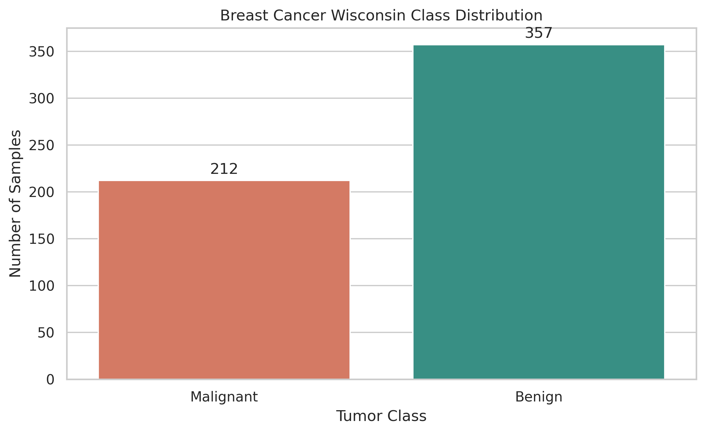
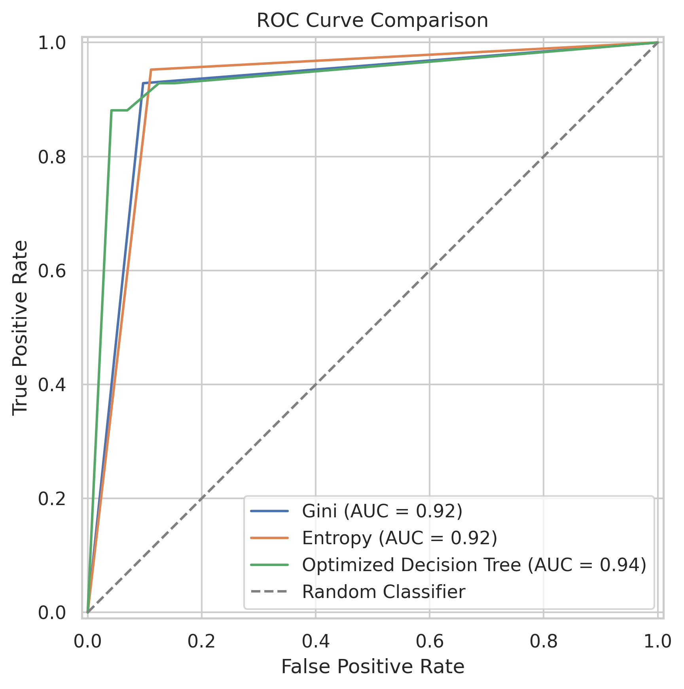
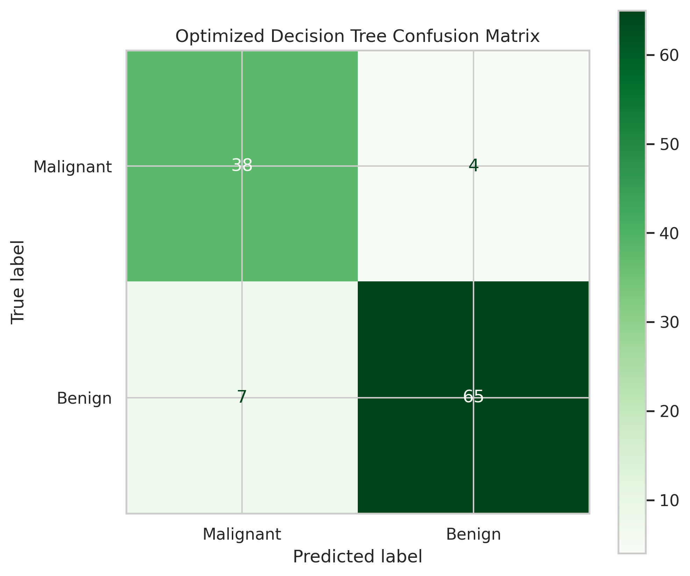
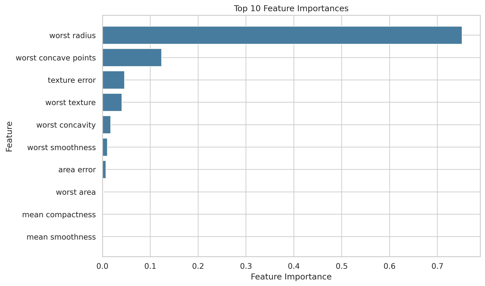

<div align="center">

# Breast Cancer Decision Tree Classification

### Explainable Tumor Classification with Decision Trees and Hyperparameter Optimization

An end-to-end machine learning project for classifying breast tumors as malignant or benign using the Breast Cancer Wisconsin dataset.

<br>

[](https://colab.research.google.com/github/betulaltunyuva/breast-cancer-decision-tree-classification/blob/main/Breast_Cancer_Wisconsin.ipynb)


</div>

---

## About the Project

This project uses the Breast Cancer Wisconsin Diagnostic dataset provided by Scikit-learn to classify tumors as:

- **Malignant:** Cancerous tumor
- **Benign:** Non-cancerous tumor

The project goes beyond a basic accuracy comparison. It includes exploratory data analysis, stratified data splitting, multiple evaluation metrics, hyperparameter optimization, model explainability, ROC analysis, confusion matrices, and detailed examination of misclassified samples.

Because missing a malignant tumor is a particularly important error, the evaluation places special emphasis on **malignant recall**.

> **Important:** This project was developed for educational and portfolio purposes. It is not a clinical diagnostic system and must not be used for medical decision-making.

---

## Table of Contents

- [Project Objectives](#project-objectives)
- [Dataset](#dataset)
- [Project Workflow](#project-workflow)
- [Models](#models)
- [Hyperparameter Optimization](#hyperparameter-optimization)
- [Evaluation Metrics](#evaluation-metrics)
- [Model Results](#model-results)
- [Visual Results](#visual-results)
- [Model Explainability](#model-explainability)
- [Error Analysis](#error-analysis)
- [Project Structure](#project-structure)
- [Installation](#installation)
- [Usage](#usage)
- [Limitations](#limitations)
- [Future Improvements](#future-improvements)
- [Author](#author)

---

## Project Objectives

The main objectives of this project are:

- Explore the structure and class distribution of the dataset
- Check for missing and duplicated observations
- Analyze relationships between features and tumor classes
- Train Gini and Entropy-based decision trees
- Detect possible overfitting
- Evaluate models using multiple classification metrics
- Optimize decision tree hyperparameters with GridSearchCV
- Compare baseline and optimized models
- Examine feature importance values
- Analyze misclassified and critical samples

---

## Dataset

The project uses the Breast Cancer Wisconsin Diagnostic dataset available through:

```python
from sklearn.datasets import load_breast_cancer
```

### Dataset Summary

| Property | Value |
|---|---:|
| Total samples | 569 |
| Features | 30 |
| Malignant samples | 212 |
| Benign samples | 357 |
| Missing values | 0 |
| Target classes | 2 |

The features describe characteristics computed from digitized images of breast mass cell nuclei, including measurements related to:

- Radius
- Texture
- Perimeter
- Area
- Smoothness
- Compactness
- Concavity
- Symmetry

The target labels used by the original Scikit-learn dataset are:

- `0` — Malignant
- `1` — Benign

---

## Project Workflow

1. Load the Breast Cancer Wisconsin dataset
2. Convert the features into a Pandas DataFrame
3. Check missing values and duplicated observations
4. Examine the class distribution
5. Analyze correlations with the malignant class
6. Perform a stratified 80/20 train-test split
7. Train baseline Gini and Entropy decision trees
8. Evaluate the models using multiple metrics
9. Apply five-fold stratified GridSearchCV
10. Evaluate the optimized decision tree
11. Compare ROC curves and confusion matrices
12. Analyze feature importance values
13. Examine misclassified samples and critical errors

---

## Models

Three decision tree models were evaluated:

### 1. Gini Decision Tree

A baseline decision tree using Gini impurity as the splitting criterion.

### 2. Entropy Decision Tree

A baseline decision tree using information gain through the Entropy criterion.

### 3. Optimized Decision Tree

A decision tree selected through five-fold stratified GridSearchCV using macro F1-score as the optimization metric.

The unpruned baseline models reached perfect training accuracy, which indicated a risk of overfitting. Hyperparameter optimization was therefore used to obtain a more controlled tree.

---

## Hyperparameter Optimization

The following parameters were evaluated with GridSearchCV:

- `criterion`
- `max_depth`
- `min_samples_split`
- `min_samples_leaf`
- `class_weight`

The best parameters were:

```python
{
    "class_weight": None,
    "criterion": "gini",
    "max_depth": 5,
    "min_samples_leaf": 4,
    "min_samples_split": 2
}
```

The best five-fold cross-validation macro F1-score was:

```text
0.934
```

Parameter selection was performed only on the training data. The test set was kept separate for final evaluation.

---

## Evaluation Metrics

The models were evaluated using:

| Metric | Description |
|---|---|
| Accuracy | Overall proportion of correct predictions |
| Malignant Precision | Proportion of malignant predictions that were correct |
| Malignant Recall | Proportion of actual malignant samples detected by the model |
| Malignant F1-score | Harmonic mean of malignant precision and recall |
| ROC-AUC | Ability of the model to distinguish between the two classes |

Accuracy alone may hide clinically important errors. For this reason, malignant recall and the number of malignant samples incorrectly predicted as benign were also examined.

---

## Model Results

| Model | Train Accuracy | Test Accuracy | Malignant Precision | Malignant Recall | Malignant F1 | ROC-AUC |
|---|---:|---:|---:|---:|---:|---:|
| Gini | 1.000 | 0.912 | 0.848 | 0.929 | 0.886 | 0.916 |
| Entropy | 1.000 | 0.912 | 0.833 | **0.952** | **0.889** | 0.921 |
| Optimized Decision Tree | 0.976 | 0.904 | 0.844 | 0.905 | 0.874 | **0.936** |

### Key Findings

- The **Entropy model** achieved the highest malignant recall at `0.952`.
- The Entropy model correctly detected approximately 95.2% of malignant test samples.
- The **optimized decision tree** achieved the highest ROC-AUC at `0.936`.
- Hyperparameter optimization reduced the difference between training and test accuracy.
- The optimized model incorrectly classified four malignant samples as benign.
- No single model was best across every evaluation metric.

Although the Entropy model achieved the strongest malignant recall on this test split, final model selection should not rely on a single holdout result. Cross-validation performance and evaluation on external datasets should also be considered.

---

## Visual Results

### Class Distribution

The dataset contains more benign samples than malignant samples, while both classes remain sufficiently represented for stratified model evaluation.



### ROC Curve Comparison

The ROC curves compare the class-separation performance of the baseline and optimized decision trees.



### Optimized Model Confusion Matrix

The confusion matrix shows the correct and incorrect predictions made by the optimized decision tree.



---

## Model Explainability

Decision trees provide built-in feature importance values that help describe which variables contribute most strongly to model decisions.



Feature importance values improve model interpretability, but they do not establish a causal relationship between a feature and breast cancer.

---

## Error Analysis

The notebook includes a separate analysis of misclassified test samples.

For every misclassified sample, the analysis displays:

- Actual tumor class
- Predicted tumor class
- Predicted malignant probability
- Prediction confidence
- Values of the most influential features

Particular attention is given to **false-negative malignant cases**, where a malignant sample is incorrectly predicted as benign.

This error type is especially important when evaluating models developed with medical datasets.

---

## Technologies

| Technology | Purpose |
|---|---|
| Python | Core programming language |
| Pandas | Data manipulation and analysis |
| NumPy | Numerical operations |
| Matplotlib | Data visualization |
| Seaborn | Statistical visualization |
| Scikit-learn | Dataset, modeling, optimization, and evaluation |
| Google Colab | Notebook development environment |
| Jupyter Notebook | Interactive project presentation |

---

## Project Structure

```text
breast-cancer-decision-tree-classification/
├── images/
│   ├── class_distribution.png
│   ├── feature_importance.png
│   ├── optimized_confusion_matrix.png
│   └── roc_curve_comparison.png
├── Breast_Cancer_Wisconsin.ipynb
├── requirements.txt
└── README.md
```

---

## Installation

Clone the repository:

```bash
git clone https://github.com/betulaltunyuva/breast-cancer-decision-tree-classification.git
```

Move into the project directory:

```bash
cd breast-cancer-decision-tree-classification
```

Create a virtual environment:

```bash
python -m venv venv
```

Activate the virtual environment on Windows:

```powershell
.\venv\Scripts\Activate.ps1
```

Activate it on Linux or macOS:

```bash
source venv/bin/activate
```

Install the dependencies:

```bash
pip install -r requirements.txt
```

---

## Usage

Start Jupyter Notebook:

```bash
jupyter notebook
```

Then open:

```text
Breast_Cancer_Wisconsin.ipynb
```

Run all notebook cells from top to bottom.

Alternatively, use the **Open in Colab** button at the top of this README to run the project without a local installation.

---

## Limitations

- The dataset contains a relatively small number of samples.
- The models were evaluated using a single dataset.
- No external clinical dataset was used for validation.
- Decision tree performance may vary with a different train-test split.
- Built-in feature importance values do not prove causality.
- The project does not include probability calibration.
- The models are not suitable for real clinical diagnosis or treatment decisions.

---

## Future Improvements

Possible future improvements include:

- Compare decision trees with Random Forest, Logistic Regression, and Support Vector Machines
- Add repeated stratified cross-validation
- Evaluate probability calibration
- Use permutation importance or SHAP for additional explainability
- Perform external dataset validation
- Add automated notebook tests
- Build an interactive prediction interface
- Add model persistence and reproducible inference scripts

---

## Author

**Betül Altunyuva**

Software Engineering Student

[GitHub Profile](https://github.com/betulaltunyuva)

---

<div align="center">

Developed for machine learning education and portfolio demonstration.

If you find this project useful, consider giving it a star.

</div>
